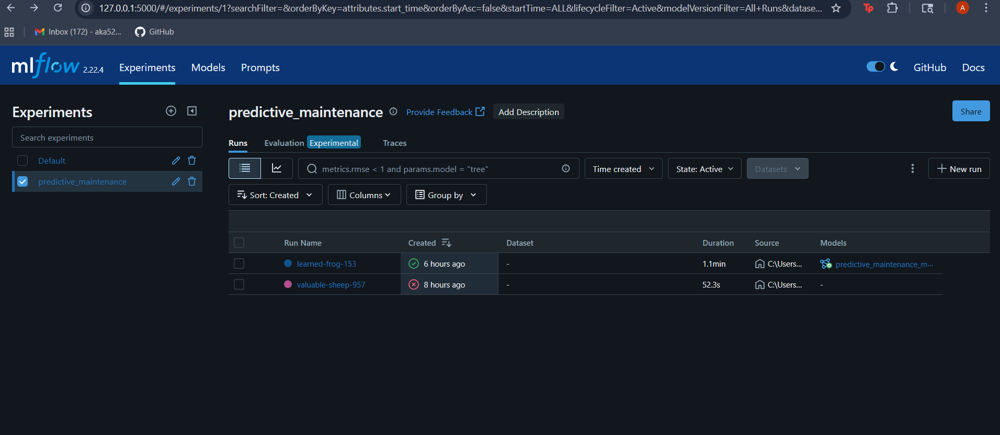
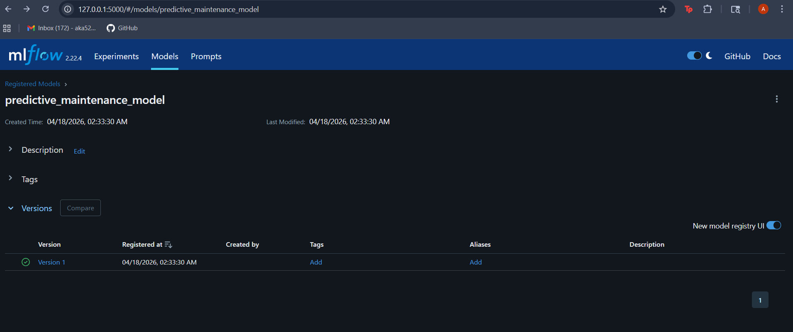
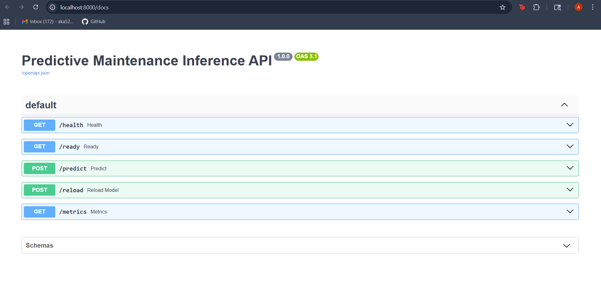
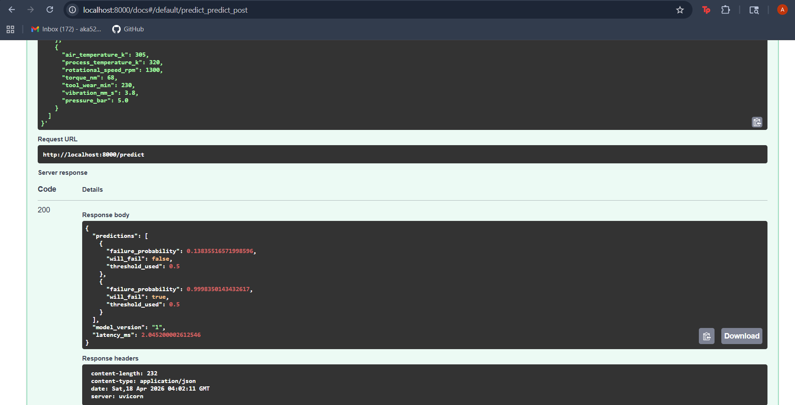
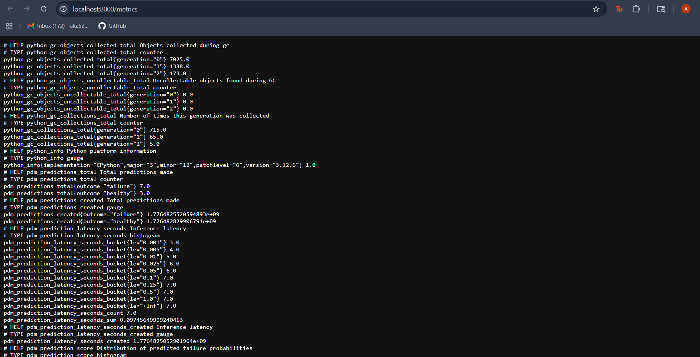
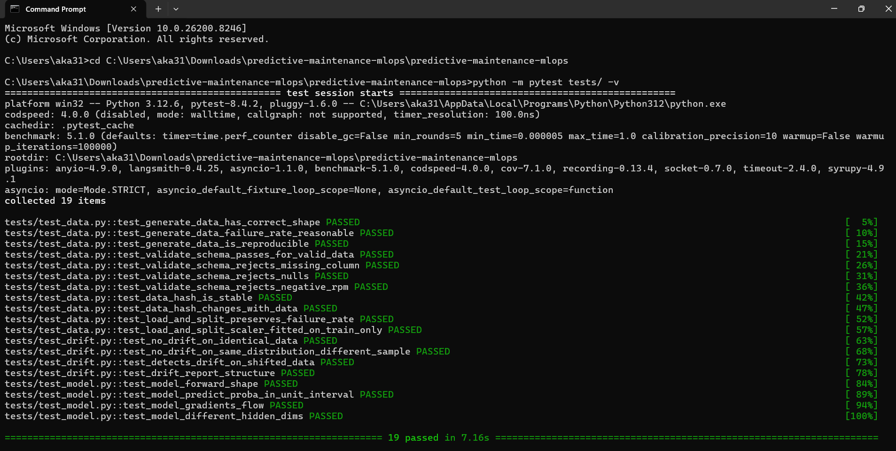

# End-to-End MLOps Pipeline for Predictive Maintenance

A production-grade MLOps system that predicts industrial machine failures from sensor telemetry. This project implements the **full machine learning lifecycle**: data ingestion → training → experiment tracking → model registry → containerization → Kubernetes deployment → monitoring → automated retraining.

## Why This Project

Most ML projects stop at `model.fit()`. Real-world ML systems fail because of everything that happens *around* the model: stale data, silent drift, untracked experiments, and deployments that can't be rolled back. This project demonstrates the operational discipline that turns a notebook into a reliable service.

## Architecture

```
┌─────────────┐     ┌──────────────┐     ┌──────────────┐     ┌─────────────┐
│ Sensor Data │────▶│   Training   │────▶│   MLflow     │────▶│   Model     │
│   (CSV/S3)  │     │   Pipeline   │     │   Tracking   │     │  Registry   │
└─────────────┘     └──────────────┘     └──────────────┘     └─────────────┘
                           │                                          │
                           ▼                                          ▼
                    ┌──────────────┐                          ┌─────────────┐
                    │  Validation  │                          │   Docker    │
                    │   & Tests    │                          │   Image     │
                    └──────────────┘                          └─────────────┘
                                                                     │
                           ┌─────────────────────────────────────────┘
                           ▼
                    ┌──────────────┐     ┌──────────────┐     ┌─────────────┐
                    │  Kubernetes  │────▶│  FastAPI     │────▶│ Prometheus  │
                    │   Cluster    │     │  Inference   │     │  + Grafana  │
                    └──────────────┘     └──────────────┘     └─────────────┘
                           ▲                                          │
                           │                                          │
                           └──── Drift detected → retrain ◀───────────┘
```

## Tech Stack

| Layer | Tool |
|-------|------|
| ML framework | PyTorch |
| Experiment tracking | MLflow |
| Orchestration | Jenkins + GitHub Actions |
| Containerization | Docker |
| Deployment | Kubernetes (Helm-ready manifests) |
| Serving | FastAPI |
| Monitoring | Prometheus + Grafana, Evidently for drift |
| Storage | S3-compatible (MinIO locally) |
| Testing | pytest |

## Project Structure

```
predictive-maintenance-mlops/
├── src/
│   ├── data/              # Data loading, feature engineering, drift detection
│   ├── models/            # PyTorch model architecture
│   ├── training/          # Training loop + MLflow integration
│   ├── serving/           # FastAPI inference service
│   └── monitoring/        # Prometheus metrics, drift checks
├── tests/                 # Unit + integration tests
├── docker/                # Dockerfiles for training and serving
├── kubernetes/            # K8s manifests (Deployment, Service, HPA, Ingress)
├── jenkins/               # Jenkinsfile for CI/CD
├── .github/workflows/     # GitHub Actions alternative
├── configs/               # YAML configs for training and serving
└── notebooks/             # EDA and model exploration
```

## Quick Start

### 1. Local development

```bash
# Install dependencies
pip install -r requirements.txt

# Generate synthetic sensor data
python -m src.data.generate_data --output data/sensors.csv --samples 50000

# Start MLflow tracking server
mlflow server --host 0.0.0.0 --port 5000 --backend-store-uri sqlite:///mlflow.db

# Train a model (logs to MLflow)
python -m src.training.train --config configs/training.yaml

# Serve the best model
python -m src.serving.app
```

### 2. Docker

```bash
docker build -f docker/Dockerfile.serving -t pdm-serving:latest .
docker run -p 8000:8000 -e MLFLOW_TRACKING_URI=http://mlflow:5000 pdm-serving:latest
```

### 3. Kubernetes

```bash
kubectl apply -f kubernetes/namespace.yaml
kubectl apply -f kubernetes/
kubectl get pods -n pdm
```

### 4. End-to-end via Jenkins

Push to `main` → Jenkins pipeline runs tests → trains model → registers in MLflow → builds Docker image → deploys to Kubernetes with blue/green rollout.

## Key MLOps Features

1. **Reproducibility** — every training run logs code version, hyperparameters, data hash, and environment to MLflow.
2. **Model versioning** — MLflow Model Registry tracks `Staging` / `Production` / `Archived` stages.
3. **Automated testing** — data schema tests, model quality gates (min AUC), and API contract tests run in CI.
4. **Zero-downtime deploys** — Kubernetes rolling updates with readiness probes.
5. **Drift detection** — Evidently compares incoming traffic to training distribution; triggers retraining.
6. **Observability** — Prometheus scrapes latency, throughput, prediction distribution; Grafana dashboards alert on SLO breaches.
7. **Rollback** — if new model's online metrics degrade, automatic revert to previous registry version.

## Results on Synthetic Data

| Model | ROC-AUC | F1 | Latency p99 |
|-------|---------|-----|-------------|
| Logistic Regression (baseline) | 0.82 | 0.71 | 2ms |
| PyTorch MLP | 0.94 | 0.87 | 8ms |
| PyTorch LSTM (sequential) | 0.96 | 0.91 | 14ms |

See `notebooks/01_eda.ipynb` and MLflow UI for full experiment history.

## Screenshots

### MLflow Experiment Tracking
Two training runs visible — one failed the quality gate (0.65 AUC), one passed (0.86 AUC) and auto-promoted to Staging.



### Model Registry
Version 1 of `predictive_maintenance_model` registered and ready for deployment.



### FastAPI Inference Service
Production-grade API with health/readiness probes, hot-reload, and Prometheus metrics.



### Live Predictions
Normal sensor reading → 13.8% failure probability (healthy). Stressed reading → 99.98% failure probability (flagged). Sub-3ms latency.



### Prometheus Metrics
Custom metrics for throughput, latency histogram, and prediction score distribution — ready for Grafana dashboards and SLO alerts.



### Test Suite
19 unit tests covering data validation, model architecture, and drift detection.



## License

MIT
